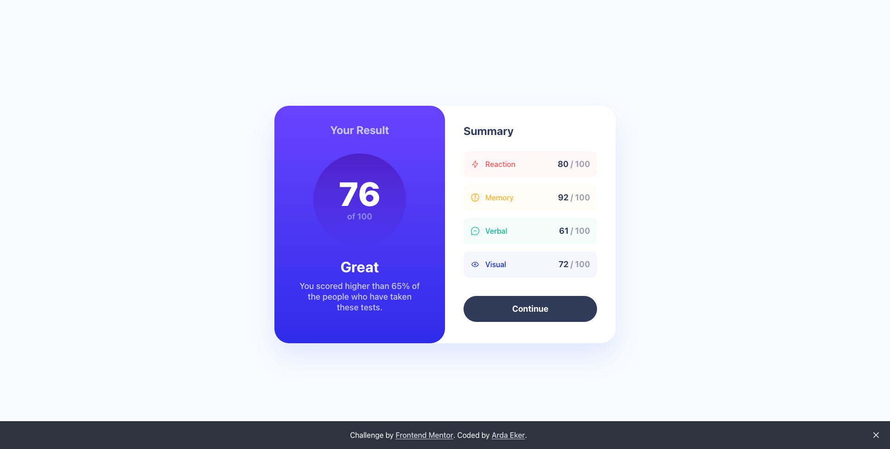
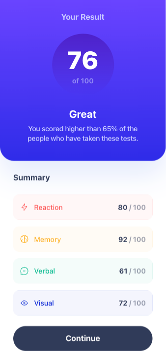

# Frontend Mentor - Results summary component solution

This is a solution to the [Results summary component challenge on Frontend Mentor](https://www.frontendmentor.io/challenges/results-summary-component-CE_K6s0maV).

## Table of contents

- [Overview](#overview)
  - [The challenge](#the-challenge)
  - [Screenshot](#screenshot)
  - [Links](#links)
  - [Built with](#built-with)
- [Author](#author)

## Overview

### The challenge

Users should be able to:

- View the optimal layout for the interface depending on their device's screen size
- See hover and focus states for all interactive elements on the page
- **Bonus**: Use the local JSON data to dynamically populate the content

## Screenshot

|          Desktop          |
| :-----------------------: |
|  |

|              Mobile              |
| :------------------------------: |
|  |

## Links

- Solution URL: [Solution]()
- Live Site URL: [Live Site]()

## Built with

- Semantic HTML5 markup
- Mobile-first workflow
- [Next.js](https://nextjs.org/) - React framework
- [Tailwind CSS](https://tailwindcss.com) - For styles

## Author

- Website - [www.ardaeker.com](https://ardaeker.com)
- Frontend Mentor - [@ardaeker](https://www.frontendmentor.io/profile/ardaeker)
